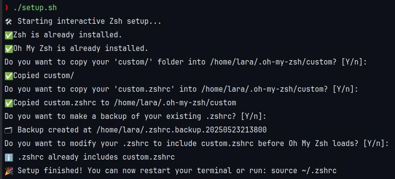

# ZSHRC CUSTOM

Personalized **Oh My Zsh** setup to eliminate repetitive configurations and organize your shell environment efficiently.

## Features

- Modular and organized `.zshrc` configuration
- Easy setup with a single script
- Simple customization: add your own functions and scripts

## Screenshots



## Installation

1. **Clone this repository:**
   ```bash
   git clone https://github.com/larafriend/zshrc-custom.git
   ```

2. Grant execution permissions to the setup script:

   ```bash
   chmod +x setup.sh
   ```
3. Run setup:

   ```bash
   ./setup.sh
   ```

## Customization

You can easily add your own functions or scripts. Place your custom files in the custom.zshrc file or source them from
there. All files referenced in custom.zshrc will be loaded into your .zshrc automatically.
